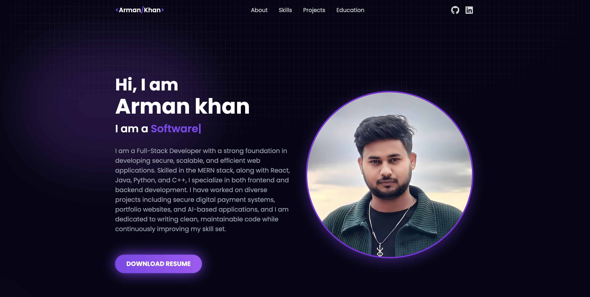

# Arman-Portfolio-main

## 🌐 Portfolio Website

A modern personal portfolio website built with **React.js**, **Tailwind CSS**, and **TypeScript**.  
This portfolio showcases my projects, skills, and experiences in a visually appealing and responsive design.

🌍 **Live Demo:** [Portfolio Website](https://portfolio-main-one-ruddy.vercel.app/)

---

## 🚀 Features

- ⚡ **Fast and Responsive** – Optimized for all screen sizes  
- 🎨 **Modern UI/UX** – Styled with Tailwind CSS  
- 🔄 **Reusable Components** – Modular React components  
- 📂 **Projects Showcase** – Highlighted portfolio projects  
- 🌙 **Theme Support** – Light and dark mode ready (if configured)  
- 🔗 **Social Links** – Connects to GitHub, LinkedIn, etc.  

---

## 🛠️ Tech Stack

- **Frontend:** React.js, TypeScript  
- **Styling:** Tailwind CSS  
- **Build Tool:** Vite / Create React App (depending on setup)  
- **Deployment:** Vercel / Netlify / GitHub Pages  

---

## 📦 Installation & Setup

Clone the repo and install dependencies:

```bash
git clone https://github.com/yourusername/Arman-Portfolio.git
cd Arman-Portfolio-main
npm install
```

## Run the development server

```bash
npm run dev
```

## 📁 Project Structure

```bash
Arman-Portfolio-main/
│── public/            # Static assets
│── src/               # Main source code
│   ├── assets/        # Images, icons, etc.
│   ├── components/    # Reusable UI components
│   ├── pages/         # Page components
│   ├── App.tsx        # Root component
│   └── main.tsx       # Entry point
│── package.json       # Project metadata and dependencies
│── tailwind.config.js # Tailwind CSS config
│── tsconfig.json      # TypeScript config
```

## 🌍 Deployment

You can deploy this portfolio easily using:

Vercel → vercel deploy

Netlify → Connect repo & auto-deploy

GitHub Pages → With gh-pages

## 📸 Screenshots

Home Page



🤝 Contributing

If you'd like to contribute or suggest improvements, feel free to fork this repo and submit a pull request.


👤 Author

Arman Khan
